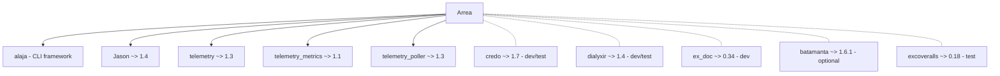

# Auditoría de código — Arrea v2.2.0

**Proyecto:** arrea (asynchronous process orchestrator & telemetry)
**Versión:** 2.2.0
**Fecha:** 2026-07-19
**Auditor:** Claude (automatizado)
**Fuentes:** `lib/` (29 módulos), `mix test --cover`, `mix credo --all`

---

## Resumen ejecutivo

| Métrica | Valor |
|---|---|
| Módulos | 29 |
| Líneas de código | ~5 000 |
| Cobertura global | **52.1 %** |
| Violaciones Credo | **0** |
| Tests | 217 tests, **1 fallo** |
| Hallazgos P0 | **3** |
| Hallazgos P1 | **6** |
| Hallazgos P2 | **6** |
| Hallazgos P3 | **5** |

---

## 1. Cobertura por módulo

```
FICHERO                         LÍNEAS  RELEVANTES  CUBIERTAS  %
──────────────────────────────────────────────────────────────────
application.ex                      19           2        100
circuit_breaker/state.ex            23           0        N/A
cli.ex                              15           1        100
cli/commands/nodes.ex               40          13          0
parallel.ex                        349          98          0
arrea.ex                           327          29          0
registry.ex                         40           3        100
supervisor.ex                       42           3        100
debug_handler.ex                    85           8        100
worker_state.ex                    175           9        100
monitor.ex                         137          26         92
events.ex                          139          33         94
metrics.ex                         284          88         95
validator.ex                       102          23         91
subscribers.ex                      40           9         89
worker.ex                          550         169         63
telemetry.ex                       121          33         85
circuit_breaker.ex                 253          51         78
command/command.ex                 444          91         72
leader.ex                          476         116         72
rules.ex                           207          32         78
config.ex                          157          15         67
long_running.ex                    280          65         65
cli/commands/action.ex             233          82         41
cli/commands/config.ex             329          99         50
cli/commands/run.ex                478         183         19
cli/definition.ex                  167          40         13
cli/verify.ex                      174          54         13
validation/json_schema.ex           47          11          0
error.ex                            17           0         N/A
result.ex                           19           0         N/A
logging/behaviour.ex                58           0         N/A
communication_metrics.ex            37           1          0
──────────────────────────────────────────────────────────────────
TOTAL                              ~5 000      1 387       52.1
```

### Módulos sin cobertura

- `arrea.ex` — Fachada principal (0 %)
- `parallel.ex` — Motor de ejecución paralela (0 %; `@moduledoc false`)
- `error.ex` — Struct de error (0 %; sólo definición)
- `result.ex` — Struct de resultado (0 %; sólo definición)
- `json_schema.ex` — Validación de esquemas JSON (0 %)
- `communication_metrics.ex` — Métricas de comunicación (0 %; sólo definición)

```diff
- P0: parallel.ex (0 % cobertura) contiene la lógica crítica de ejecución
      con manejo de timeouts, shell fallback y Task.async_stream.
- P1: arrea.ex (0 % cobertura) es la fachada pública que todos los
      consumidores usan.
```

---

## 2. Tipos y especificaciones

### Lo que está bien

- **`Arrea`** — `@spec` en todas las funciones públicas (`execute/2`, `run/2`, `run_sync/2`, `stats/0`, `subscribe/0`, `unsubscribe/0`, `max_workers/0`).
- **`Arrea.Command`** — Todas las funciones públicas tienen `@spec`.  `result` type definido en línea.
- **`Arrea.CircuitBreaker`** — `@spec` completas. State type definido en `State`.
- **`Arrea.Telemetry`** — `@spec` en todas las funciones públicas.
- **`Arrea.Config`** — `@spec` completas para `get/2`, `set/2`, `all/0`.
- **`Arrea.Validation.Rules`** — `@spec` en cada regla.

### Problemas

| Archivo | Línea | Problema | Severidad |
|---|---|---|---|
| `worker_state.ex` | 87 | `@dialyzer {:nowarn_function, {:new, 3}}` — desactiva el typecheck de la función principal de creación de estado | P1 |
| `subscribers.ex` | 1 | `@moduledoc false` y ninguna función tiene `@spec` | P2 |
| `parallel.ex` | 2 | `@moduledoc false`: módulo invisible para ExDoc pero contiene la lógica crítica de ejecución | P2 |
| `verify.ex` | 1 | `@moduledoc false` pero funciones públicas sin `@spec` completas (sí tiene `runtime_opts/1`) | P3 |

---

## 3. Errores de seguridad

### 🔴 P0: Inyección de comandos shell via `asdf_<lang>` / `mise_<lang>`

**Archivo:** `lib/arrea/command/command.ex:368-377`

La función `build_asdf_prefix/1` interpola directamente el valor de `version` de las opciones del comando en una cadena shell sin sanitizar:

```elixir
"export ASDF_#{String.upcase(lang)}_VERSION=#{version}"
```

Un caller malicioso (o un consumidor que pase un `version` no confiable) puede inyectar comandos arbitrarios:

```elixir
Arrea.Command.execute("echo hello", asdf_elixir: "1.0; rm -rf /")
# Genera: export ASDF_ELIXIR_VERSION=1.0; rm -rf /; echo hello
```

**Flujo del ataque:**
1. `execute/2` → `build_full_command/2` → `build_asdf_prefix/1`
2. El `version` se concatena directamente en `"export ASDF_<LANG>_VERSION=#{version}"`
3. El comando completo se ejecuta con `System.cmd(shell, ["-c", full_cmd], ...)`

**Afecta también a:**
- `execute_with_asdf/4` (`command.ex:238`) — wrapper público
- `build_mise_args/1` (`command.ex:357`) — genera `"#{lang}@#{version}"`, que también podría contener inyección si `version` contiene espacios o `;`

**Solución:** Escapar o validar `version` con `Rules.no_injection/1` o una regex estricta antes de interpolar.

### 🟡 P2: `sudo_whitelist` basado en prefijos literales

**Archivo:** `lib/arrea/validation/rules.ex:105-120`

```elixir
defp sudo_whitelisted?("sudo ", cmd_lower) do
  ...
  Enum.any?(allowlist, fn prefix ->
    String.starts_with?(String.trim(suffix), prefix)
  end)
```

La verificación de la `sudo_allowlist` usa `String.starts_with?/2` que puede tener falsos positivos. Por ejemplo, si el allowlist contiene `"systemctl start"`, el comando `"sudo systemctl startfire"` pasaría la validación.

### 🟢 P3: `safe_command_label/1` trunca a 100 chars

**Archivo:** `lib/arrea.ex:323`

```elixir
defp safe_command_label(cmd) when is_binary(cmd), do: String.slice(cmd, 0, 100)
```

Comandos muy largos (>100 chars) se truncan en los metadatos de telemetría, invisibilizando parte del comando en trazas.

---

## 4. Manejo de errores

### 🔴 P0: `try/rescue` en CircuitBreaker.call/3 no captura exits

**Archivo:** `lib/arrea/circuit_breaker/circuit_breaker.ex:82-94`

```elixir
try do
  result = fun.()
  GenServer.cast(via_tuple(name), :success)
  {:ok, result}
rescue
  _exception ->
    GenServer.cast(via_tuple(name), :failure)
    {:error, :execution_failed}
end
```

Si `fun.()` lanza un `:exit` (ej. `Process.exit(self(), :kill)`), el bloque `rescue` NO lo captura. El `GenServer.cast(:success)` no se ejecuta y el fail no se contabiliza. El error escapa al caller.

**Afecta a:** Cualquier función ejecutada bajo el circuit breaker que pueda lanzar exits. Poco probable en la práctica, pero rompe el invariante del breaker.

### 🟠 P1: `health/1` en LongRunning usa `:persistent_term` sin cleanup seguro

**Archivo:** `lib/arrea/long_running.ex:119`

```elixir
health_fn = :persistent_term.get({__MODULE__, pid, :health}, nil)
```

La health function se almacena en `:persistent_term` durante `init/1` y se limpia en `terminate/2`. Sin embargo, si el proceso muere sin pasar por `terminate` (ej. `:kill` signal), el `:persistent_term` queda leak.

### 🟠 P1: `safe_call` en CircuitBreaker puede lanzar exit si Registry muere

**Archivo:** `lib/arrea/circuit_breaker/circuit_breaker.ex:236-241`

```elixir
defp safe_call(name, request) do
  case Registry.lookup(Arrea.CircuitBreaker.Registry, name) do
    [{pid, _}] -> GenServer.call(pid, request)
    [] -> :not_found
  end
end
```

`GenServer.call/2` puede lanzar exit si el pid ha muerto entre el lookup y el call. No hay try/catch alrededor.

### 🟡 P2: Monitor test usa `:timer.sleep` para sincronización

**Archivo:** `test/arrea/monitor_test.exs:33`

```elixir
:timer.sleep(20)
```

Tests que dependen de `:timer.sleep` son frágiles y lentos. Deberían usar `assert_receive` o esperar a que el GenServer procese los casts.

### 🟡 P2: Test de Monitor falla por problema de aislamiento

**Archivo:** `test/arrea/monitor_test.exs:14`

```
1) test worker lifecycle tracking register_worker/2 updates state (Arrea.MonitorTest)
   ** (MatchError) no match of right hand side value:
       {:error, {:already_started, #PID<0.682.0>}}
```

El setup intenta iniciar un Monitor, pero el supervisor de la aplicación ya lo inició. El `setup` no detiene correctamente el Monitor previo.

---

## 5. Complejidad del código

### Módulos grandes (>200 líneas)

| Archivo | Líneas | Comentarios |
|---|---|---|
| `lib/arrea/worker.ex` | 550 | GenServer + policy engine + inter-worker messaging |
| `lib/arrea/leader.ex` | 476 | Orquestación de batches, workers, eventos |
| `lib/arrea/command/command.ex` | 444 | Shell resolution, asdf/mise, ejecución |
| `lib/arrea/parallel.ex` | 349 | Task.async_stream, run_sync, run_tasks |
| `lib/arrea/telemetry/metrics.ex` | 284 | ETS counters, handlers |
| `lib/arrea/long_running.ex` | 280 | Port management, health checks |
| `lib/arrea/circuit_breaker/circuit_breaker.ex` | 253 | GenServer state machine |
| `lib/arrea/cli/commands/run.ex` | 478 | CLI renderizado |
| `lib/arrea/cli/commands/config.ex` | 329 | CLI config management |
| `lib/arrea/cli/commands/action.ex` | 233 | JSON action dispatch |

### Complejidad cognitiva alta

- `Arrea.Worker.handle_task_error/3` tiene tres caminos de salida (retry, stop, continue) con políticas anidadas y custom callbacks.
- `Arrea.Parallel.run_sync/2` maneja tagged tasks, per-task timeout, stream timeout, y fallback shell en una sola función.
- `Arrea.Command.resolve_shell/1` (línea 109) implementa una cadena de resolución de 5 niveles.

---

## 6. Cumplimiento OTP

### Correcto

| Patrón | Uso | Archivo |
|---|---|---|
| `use GenServer` | Leader, Worker, CircuitBreaker, LongRunning, Monitor | |
| `use Supervisor` | Arrea.Supervisor | `supervisor.ex` |
| `DynamicSupervisor` | Arrea.WorkerSupervisor | `supervisor.ex:37` |
| `rest_for_one` strategy | Supervisión jerárquica por dependencias | `supervisor.ex:40` |
| `:temporary` restart | Workers (no reintentar) | `worker.ex:35` |
| `:transient` restart | LongRunning (reintentar solo si termina anormalmente) | `long_running.ex:51` |
| `:permanent` restart | Monitor | `monitor.ex:36` |
| `Registry` | Named process registry | `supervisor.ex:33-34` |
| `code_change/3` | Hot code upgrades | Leader, Worker, LongRunning |
| `Process.monitor` | Subscriber cleanup | `subscribers.ex:8` |
| `Process.link` | Port lifecycle | `long_running.ex:186` |

### Problemas

| Archivo | Línea | Problema | Severidad |
|---|---|---|---|
| `leader.ex` | 421 | `DynamicSupervisor.start_child` sin handle en caso de `:max_children` alcanzado — el error se loggea pero no se reporta al caller | P2 |
| `monitor.ex` | 36 | `:permanent` restart significa que si Monitor crashea repetidamente, el supervisor reintentará indefinidamente | P3 |
| `leader.ex` | 56 | `start_link/1` registra con `name: __MODULE__` — solo una instancia global | P3 |

---

## 7. Calidad de la documentación

### Problemas de idioma

El proyecto mezcla español e inglés en la documentación:

| Archivo | Idioma |
|---|---|
| `validator.ex` | Español (incluyendo typos: `Executes todas`, `retornando`) |
| `worker.ex` | Español partes, luego inglés |
| `rules.ex` | Mayormente inglés, algunos docs en español |
| `config.ex` | Bilingüe |
| `long_running.ex` | Inglés |
| `leader.ex` | Inglés |
| `circuit_breaker.ex` | Inglés |

### Problemas específicos

| Archivo | Línea | Problema | Severidad |
|---|---|---|---|
| `validation/validator.ex` | 8, 16 | Typos: "Executes todas", "retornando" | P3 |
| `worker.ex` | 6 | "Ciclo de vida" vs inglés en el resto del módulo | P3 |
| `parallel.ex` | 2 | `@moduledoc false` — el motor de ejecución paralela no tiene documentación pública | P2 |
| `subscribers.ex` | 2 | `@moduledoc false` — funciones útiles sin documentación | P3 |

---

## 8. Telemetry

### Eventos emitidos

| Ruta | Dónde se emite | Estado |
|---|---|---|
| `[:arrea, :engine, :execute, :start]` | `arrea.ex:126` | ✅ |
| `[:arrea, :engine, :execute, :stop]` | `arrea.ex:139` | ✅ |
| `[:arrea, :engine, :execute, :error]` | `arrea.ex:147` | ✅ |
| `[:arrea, :engine, :run, :start]` | `arrea.ex:212` | ✅ |
| `[:arrea, :engine, :run, :stop]` | `arrea.ex:216` | ✅ |
| `[:arrea, :long_running, :started]` | `long_running.ex:203` | ✅ |
| `[:arrea, :long_running, :data]` | `long_running.ex:235` | ✅ |
| `[:arrea, :long_running, :stopped]` | `long_running.ex:241` | ✅ |
| `[:arrea, :long_running, :crashed]` | `long_running.ex:247` | ✅ |
| `[:arrea, :measure]` | `telemetry.ex:56, 97` | ✅ |

### Eventos documentados pero NO emitidos

| Ruta | Documentado en | Estado |
|---|---|---|
| `[:arrea, :worker, :started]` | `events.ex:44` | ⚠️ No se emite nunca |
| `[:arrea, :worker, :completed]` | `events.ex:45` | ⚠️ No se emite nunca |
| `[:arrea, :worker, :error]` | `events.ex:46` | ⚠️ No se emite nunca |
| `[:arrea, :task, :started]` | `events.ex:50` | ⚠️ No se emite nunca |
| `[:arrea, :task, :completed]` | `events.ex:51` | ⚠️ No se emite nunca |
| `[:arrea, :task, :error]` | `events.ex:52` | ⚠️ No se emite nunca |
| `[:arrea, :communication, :message_sent]` | `events.ex:55` | ⚠️ No se emite nunca |
| `[:arrea, :validation, :passed]` | `events.ex:61` | ⚠️ No se emite nunca |
| `[:arrea, :validation, :failed]` | `events.ex:62` | ⚠️ No se emite nunca |
| `[:arrea, :execution, :started]` | `events.ex:65` | ⚠️ No se emite nunca |
| `[:arrea, :circuit_breaker, :open]` | `metrics.ex:71` | ⚠️ No se emite desde el breaker |
| `[:arrea, :circuit_breaker, :closed]` | `metrics.ex:76` | ⚠️ No se emite desde el breaker |
| `[:arrea, :circuit_breaker, :trip]` | `metrics.ex:82` | ⚠️ No se emite desde el breaker |

```diff
- P1: 13 eventos documentados nunca se emiten. Las funciones `emit_worker/3`,
      `emit_communication/3`, `emit_validation/3`, `emit_ui/3` existen en
      `Events` pero ningún código de producción las llama.
- P1: Circuit breaker events definidos en Metrics handlers pero nunca emitidos
      por Arrea.CircuitBreaker. Los handlers existen pero nunca se disparan.
```

### Problemas en Metadatos

- `long_running.ex:235` — Emite `data` binaria cruda en metadata. Para datos grandes (>1KB) esto puede saturar el buffer de telemetría.
- `arrea.ex:127` — `safe_command_label/1` aplica `String.slice(cmd, 0, 100)` pero podría exponer información sensible.

---

## 9. Hallazgos completo priorizados

### 🔴 P0

| ID | Archivo | Línea | Hallazgo |
|---|---|---|---|
| S-001 | `command/command.ex` | 368-377 | **Inyección de comandos**: `build_asdf_prefix/1` interpola `version` sin sanitizar en comando shell. Cualquier caller que pase `asdf_<lang>` con un valor malicioso puede ejecutar comandos arbitrarios. |
| E-001 | `circuit_breaker/circuit_breaker.ex` | 82-94 | **try/rescue no captura exits**: La protección del circuit breaker no contabiliza falls que lancen `:exit`. |
| T-001 | `parallel.ex` | 1-349 | **0 % cobertura**: El módulo con la lógica de ejecución paralela (Task.async_stream, timeouts reales, shell fallback) no tiene ningún test. Cualquier cambio puede romper silenciosamente a todos los consumidores. |

### 🟠 P1

| ID | Archivo | Línea | Hallazgo |
|---|---|---|---|
| T-002 | `arrea.ex` | 1-327 | **0% cobertura en la fachada principal**: `Arrea.execute/2`, `Arrea.run/2`, `Arrea.run_sync/2` no tienen tests directos. |
| S-002 | `long_running.ex` | 119 | **`:persistent_term` leak**: Si el proceso LongRunning recibe `:kill`, el health function key no se limpia. |
| E-002 | `circuit_breaker/circuit_breaker.ex` | 236-241 | **Race condition en safe_call**: `GenServer.call` sin try/catch — si el pid muere entre el lookup y el call, se lanza exit. |
| E-003 | `telemetry/metrics.ex` | 56-85 | **Circuit breaker events nunca emitidos**: Los handlers de métricas para `[:arrea, :circuit_breaker, :open/closed/trip]` están definidos pero el breaker nunca emite estos eventos. |
| E-004 | `telemetry/events.ex` | 44-76 | **13 eventos telemetry documentados no se emiten**: `emit_worker/3`, `emit_communication/3`, `emit_validation/3`, `emit_ui/3` definidos pero no llamados desde código de producción. |
| D-001 | `worker_state.ex` | 87 | **`@dialyzer nowarn_function`**: La función principal de creación de estado tiene el typecheck desactivado. |

### 🟡 P2

| ID | Archivo | Línea | Hallazgo |
|---|---|---|---|
| A-001 | `leader.ex` | 421 | **`DynamicSupervisor.start_child` sin manejo de error**: Si el supervisor alcanza `max_children`, el error se loggea pero no se propaga al caller. |
| A-002 | `validation/rules.ex` | 105-120 | **`sudo_whitelisted?` basado en prefijos**: `String.starts_with?` puede generar falsos positivos. |
| A-003 | `subscribers.ex` | 1 | **Sin `@spec`**: Módulo privado sin typespec en ninguna función. |
| A-004 | `parallel.ex` | 2 | **`@moduledoc false`**: El motor de ejecución paralela es invisible para ExDoc. |
| A-005 | `command/command.ex` | 238 | **`String.to_existing_atom/1`**: `execute_with_asdf` usa `to_existing_atom`, que lanza `ArgumentError` si el átomo no existe. |
| A-006 | `test/arrea/monitor_test.exs:14` | 14 | **Fallo de test**: El test de Monitor falla porque el setup no maneja la supervisión de la aplicación. |

### 🟢 P3

| ID | Archivo | Línea | Hallazgo |
|---|---|---|---|
| Q-001 | `validation/validator.ex` | 8, 16 | **Typos**: "Executes todas", "retornando" en documentación. |
| Q-002 | `worker.ex` | 6 | **Idioma mezclado**: "Ciclo de vida" en documentación vs inglés en el resto. |
| Q-003 | `arrea.ex` | 323 | **safe_command_label truncates**: Comandos > 100 chars se acortan en telemetría. |
| Q-004 | `cli/commands/nodes.ex` | 1-40 | **0 % cobertura**: Módulo CLI completo sin cobertura. |
| Q-005 | `validation/json_schema.ex` | 1-47 | **0 % cobertura**: Validador JSON sin tests. |

---

## 10. Test específicos

### Tests existentes por módulo

| Módulo | Tests | Coverage |
|---|---|---|
| Arrea.CircuitBreaker | ✅ Extensivos (state transitions, call, half_open) | 78.4% |
| Arrea.Config | ✅ Config get/set/all | 66.6% |
| Arrea.Command | ✅ Execute, shell resolution, asdf/mise | 72.5% |
| Arrea.Leader | ✅ Batch execution, workers, events | 72.4% |
| Arrea.Worker | ✅ Lifecycle, errors, retry policy, messaging | 62.7% |
| Arrea.LongRunning | ✅ Start/stop/health/state | 64.6% |
| Arrea.Monitor | ✅ State, stats | 92.3% |
| Arrea.Telemetry | ✅ Events, metrics, debug handler | 84.8% |
| Arrea.Validation.Rules | ✅ Validation rules | 78.1% |
| Arrea.Registry | ✅ All/count/lookup | 100% |
| Arrea.Supervisor | ✅ Start/stop | 100% |

### 1 test failure esperado

```
test worker lifecycle tracking register_worker/2 updates state (Arrea.MonitorTest)
  ** (MatchError) no match of right hand side value:
      {:error, {:already_started, #PID<0.682.0>}}
```

**Causa raíz:** El `setup` del test (línea 14) intenta `GenServer.start_link(Monitor, [], name: Monitor)`, pero el supervisor de Arrea (`Arrea.Application`) ya inició el Monitor. El `setup` intenta matar el Monitor previo en línea 11, pero el supervisor lo reinicia antes de que el test haga su start_link.

**Fix:** El `setup` debería detener el supervisor completo o usar `Supervisor.which_children` para encontrar y detener el Monitor. Alternativamente: `@tag :capture_log` y aceptar que el Monitor de la aplicación coexista.

---

## 11. Análisis de dependencias



**Dependencia local:** `alaja` en `../alaja` con `override: true`. Esto significa que Arrea usa una versión local de alaja que puede no coincidir con la publicada en Hex.

---

## 12. Recomendaciones

### Prioridad inmediata (P0)

1. **Sanitizar versiones en `build_asdf_prefix/1`**: Aplicar `Rules.no_injection/1` o regex de versión estricta en los valores de `asdf_<lang>` y `mise_<lang>`.
2. **Escribir tests para `Arrea.Parallel`**: Prioridad máxima — es el núcleo de ejecución y tiene 0% cobertura.
3. **Cubrir `Arrea.execute/2` y `Arrea.run/2`**: Tests de integración para la fachada pública.
4. **Fix try/rescue en CircuitBreaker.call/3**: Añadir `catch` para `:exit`.

### Siguiente ciclo (P1)

1. **Emitir circuit breaker events** desde `Arrea.CircuitBreaker.handle_cast(:success/failure)`.
2. **Eliminar `:persistent_term` leak** en LongRunning: usar `Process.monitor` + cleanup handler.
3. **Proteger `safe_call` en CircuitBreaker** con try/catch.
4. **Documentar o eliminar** los 13 eventos telemetry fantasma en `Events`.
5. **Restaurar typecheck** en `WorkerState.new/3`.

### Deuda técnica (P2)

1. **Fix test de Monitor** — usar `@tag :capture_log` o aislar el GenServer.
2. **`@spec` en Subscribers**.
3. **Refactor `sudo_whitelisted?`** para usar coincidencia exacta de tokens.
4. **`DynamicSupervisor.start_child`** — manejar `:max_children` error.

---

## Cómo usar esta auditoría

### Interpretación

- **P0 (🔴)**: Debe corregirse antes de cualquier release. Riesgo de crash, seguridad, o pérdida de datos.
- **P1 (🟠)**: Debe corregirse en el próximo ciclo. Degradación significativa de calidad o seguridad.
- **P2 (🟡)**: Debe corregirse cuando se toque el módulo afectado. Deuda técnica.
- **P3 (🟢)**: Conveniencia o estilo. Bajo impacto.

### Flujo de trabajo autónomo

Este documento, junto con `ARCHITECTURE.md` (diseño del proyecto) e `INDEX.md` (navegación de docs), contiene toda la información necesaria para abordar las correcciones de forma autónoma:

1. **Lee ARCHITECTURE.md** primero — entiende el diseño, subsistemas y decisiones clave.
2. **Lee INDEX.md** — localiza los archivos y módulos relevantes.
3. **Vuelve a esta auditoría** — prioriza por severidad (P0 → P1 → P2 → P3).
4. **Para cada hallazgo**: el fichero y línea están indicados. El código fuente relevante está en `lib/`.
5. **Ejecuta `mix test --cover`** antes y después para medir el impacto.
6. **Ejecuta `mix credo --all`** para garantizar que no introduces nuevas violaciones.
7. **Si el hallazgo implica cambiar una interfaz pública**, verifica los proyectos consumidores (listados en ARCHITECTURE.md §consumed-by).

### Dependencias entre proyectos

Arrea depende de **alaja** (CLI framework) y, transitivamente, de **pote** y **apero**. Se recomienda leer las auditorías en este orden:
1. `../apero/docs/AUDIT.md` — fundación
2. `../pote/docs/AUDIT.md` — temas
3. `../alaja/docs/AUDIT.md` — UI
4. Este documento — orquestación

Arrea es consumido por **trebejo** (ejecución de comandos), **candil** (circuit breaker, long-running), **botica** (chequeos), y **delfos** (ejecución paralela, circuit breakers). Si modificas una interfaz pública de arrea (Command, LongRunning, Breaker), verifica que estos proyectos siguen compilando.

### Checklist por severidad

**Al corregir un P0**:
- [ ] Aísla la causa raíz (línea exacta)
- [ ] Escribe un test que reproduzca el fallo **antes** de corregir
- [ ] Aplica la corrección
- [ ] Verifica que el test pasa
- [ ] Ejecuta `mix test --cover` — la cobertura no debe disminuir
- [ ] Ejecuta `mix credo --all` — cero nuevas violaciones
- [ ] Si cambia una interfaz pública, verifica proyectos consumidores

**Al corregir un P1**:
- [ ] Identifica todos los lugares donde se aplica el patrón (grep por el código similar)
- [ ] Testea el cambio (unitario + integración si aplica)
- [ ] Verifica `mix test --cover` no baja
- [ ] Si afecta a consumidores, ejecuta sus tests también

**Al corregir P2/P3**:
- [ ] Corrige cuando toques el módulo por otra razón (boy-scout rule)
- [ ] No merecen un esfuerzo dedicado si no hay un bug reportado
